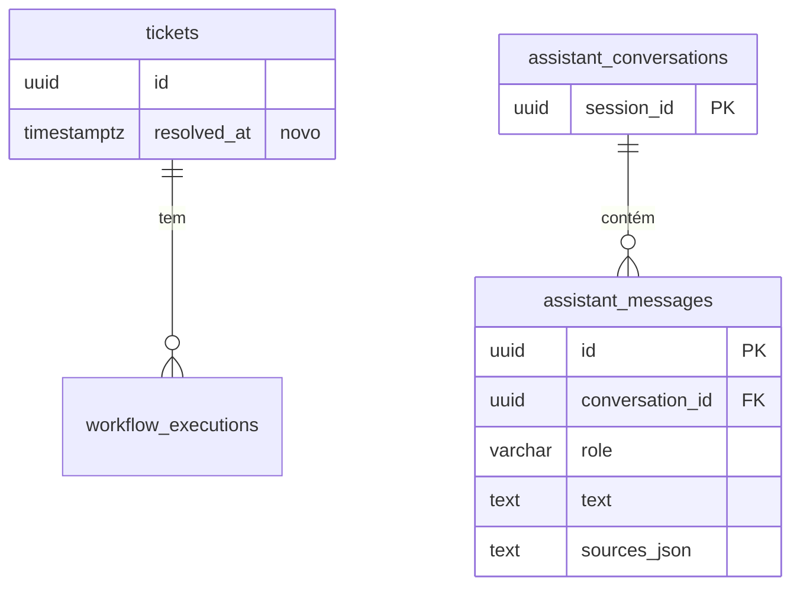

# Data Model: Refresh Operacional

## 1. `tickets` — uma coluna nova

| Coluna | Tipo | Regra |
|---|---|---|
| `resolved_at` | `timestamptz`, nullable | `NULL` = chamado aberto. Preenchido = concluído (FR-053). Setar só quando `NULL` torna a ação idempotente — repetir não sobrescreve o timestamp original. |

Nenhuma outra coluna muda. `source_system` continua fixo em `"freshservice"` para todo ticket, inclusive os criados pela nova tela — a origem estrutural do dado é a mesma (`TicketIngestRequest`), só muda quem preenche o formulário; distinguir isso não tem nenhum FR pedindo e não seria usado em lugar nenhum (YAGNI).

**Migration**: `backend/migrations/versions/004_ticket_resolution_and_conversations.py`, `ALTER TABLE tickets ADD COLUMN resolved_at TIMESTAMPTZ NULL`.

## 2. `assistant_conversations` — nova

| Coluna | Tipo | Regra |
|---|---|---|
| `session_id` | `uuid`, PK | Gerado no navegador (`crypto.randomUUID()`), nunca no servidor — não há login para amarrar a um usuário. |
| `created_at` | `timestamptz`, server default `now()` | |

## 3. `assistant_messages` — nova

| Coluna | Tipo | Regra |
|---|---|---|
| `id` | `uuid`, PK | |
| `conversation_id` | `uuid`, FK → `assistant_conversations.session_id`, `ON DELETE CASCADE` | |
| `role` | `varchar(20)` | `"user"` \| `"assistant"` — mesmo enum de `AssistantMessage.role` |
| `text` | `text` | Pergunta ou resposta. Já passou por `redaction.py` antes de chegar aqui quando é conteúdo que vai ao modelo — o que fica salvo é o texto **redigido**, nunca o original com PII (mesma regra do prompt, aplicada também à persistência: Princípio II não distingue "sair para o modelo" de "sair para o disco"). |
| `sources_json` | `text`, nullable | Serialização de `RetrievedSource[]` (ou `null`) — só para turnos `role="assistant"`, para o histórico recarregado mostrar as mesmas fontes que apareceram na hora. |
| `created_at` | `timestamptz`, server default `now()` | Ordena o replay. |

**Índice**: `(conversation_id, created_at)` — toda leitura é "histórico de uma conversa, em ordem".

**Isolamento (FR-059)**: toda query já filtra por `conversation_id = session_id` recebido no header — sem esse filtro não haveria como uma pessoa nunca ver a conversa de outra, dado que não existe usuário autenticado para filtrar por outro campo.

## 4. Vínculo Chamado↔Fonte (Key Entity do spec.md) — não é tabela

Implementado como um campo adicional na resposta do assistente, não como entidade persistida — é derivado a cada pergunta, não um registro histórico:

```python
class TicketRefSource(BaseModel):
    jira_issue_key: str
    status: WorkflowStatus
    subject: str          # conteúdo externo — mesma regra de RetrievedSource.content
    squad_id: str | None
```

`AssistantAnswer` ganha `ticket_context: TicketRefSource | None = None`, aditivo — `sources: list[RetrievedSource]` (RAG) não muda de formato, nenhum consumidor existente quebra.

## 5. `WorkflowListItem` / `WorkflowDetail` — campo aditivo

Ambos ganham `resolved_at: datetime | None`. Nenhum campo existente muda de tipo ou remove — extensão aditiva, compatível com o frontend atual até o componente ser atualizado.

## Diagrama de relações (novo nesta feature)


